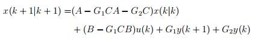
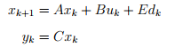
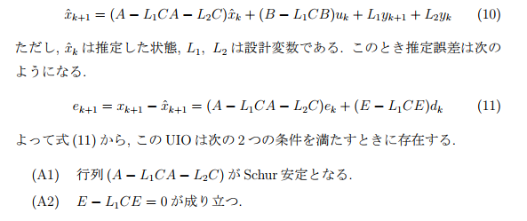
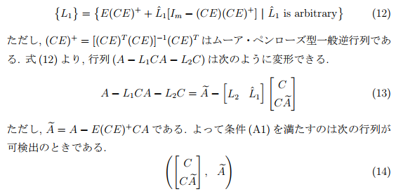
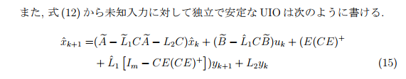

# 未知入力オブザーバ
> 未知入力オブザーバを用いたペダリングトルク推定  
> https://library.naist.jp/mylimedio/dllimedio/showpdf2.cgi/DLPDFR009769_P1-42

---
## オブザーバの種類？
- Luenberger
- 予測型
- UIO 未知入力オブザーバ

memo:Ctrl+Alt+Vでクリップボード貼り付け。

---
## 一般構造化オブザーバの定義：  

これで推定値と真値の誤差が0に漸近する場合が一般構造化オブザーバである。

G1が0であればこれはLuenbergの全次元オブザーバである。

--

UIOにおける状態方程式を次に示す。  

uが観測可能な入力でdは観測不可能な入力である。

---
## Cheokの一般構造化OBSを適用すると？

--

出力で観測できる変数の数が未知入力数をこえていれば安定だけどそうでない場合は別のオブザーバを組む必要があるそうな。

補助出力方程式というらしいぞ。

---
## Math test
OK  

$$
\sum_{k=1}^n \frac{k\lambda}{\xi}
$$

OK?

$$
\sum_{k=1}^n \frac{k\lambda}{\xi} \exp^{-j2\pi k}
$$

NOT OK  

$$
\min \sum_{k=1}^n \frac{k\lambda}{\xi} 
$$

